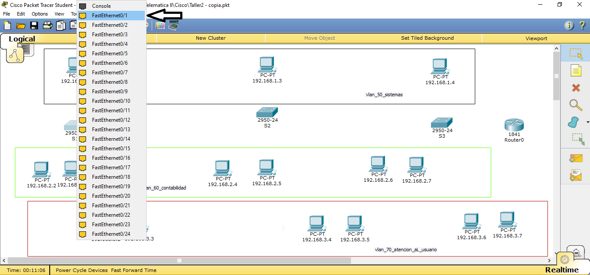

# Configuracion de vlans
Tutorial para la configuracion de vlans mediante el simulador cisco packet tracer student 

#### __INTRODUCCION:__ 
Como estudiante de Ingeniería en Sistemas de la Universidad de Nariño, considero que la configuración de VLANs en el simulador Cisco Packet Tracer es esencial para la segmentación del tráfico y el diseño eficiente de redes. Para ello, es necesario crear y asignar VLANs en los switches, configurar la comunicación entre ellas mediante el uso de enrutadores o capas de enrutamiento interno, y crear subinterfaces virtuales. Este proceso permite una mayor flexibilidad en el diseño de redes y una segmentación efectiva del tráfico, lo que resulta en una red más eficiente y fácil de administrar.

## __LABORATORIO CONFIGURACION VLANS__

### PASO 1: 

Abrir el simulador packet tracer y en la parte inferior izquierda podemos seleccionar los dispositivos que querramos utilizar, para este caso empezaremos a ubicar los computadores eligiendolos de la opcion __end devices__ donde escogemos el pc llamado __generic__ en la primera opcion. 

Seleccinamos la cantidad de PCs que vayamos a utilizar y los ubicaremos de la siguiente manera.

De preferencia nombrar cada PC con la ip que le vayamos asignar 

Para organizar nuestra area de trabajo y poder obervar mejor que PCs queremos en cada vlan se recomienda utilizar marcas para separar nuestras vlans como en la siguiente imagen.

Ya seleccionada la forma le podemos dar color a cada seccion y nombrar cada recuadro con el nombre de nuestra vlan, asi: 

## PASO 2: 

Una vez organizado nombrando cada equipo y cada area de trabajo es hora de configurar cada PC que hemos puesto, para esto daremos click en el icono del PC y se nos abrira la configuracion y daremos clic en __desktop__

Una vez dentro de la opcion __desktop__ pulsaremos el mouse en la opcion __IP configuration__ y le pondremos la IP que le asignamos de nombre en la parte inicial junto con el __Default gateway__

__Obervacion:__ el __Default gateway__ en este caso 192.168.1.1 solo se utilizara la primera vlan llamada __vlan 50 sistemas__ en las siguientes dos imagenes se mostrara el __Default gateway__ de las vlans __vlan 60 contabilidad__ y la __vlan 70 atencion al usuario__

PC tomado de la segunda seccion de nuesta vlan llamada __vlan 60 contabilidad__

PC tomado de la segunda seccion de nuesta vlan llamada __vlan 70 atencion al usuario__

## PASO 3:

Ya terminada la configuracion de cada equipo procedemos a ubicar los __switches__ que daran conexion a cada PC atraves de la creacion de las vlans.

En la parte inferior izquierda ubicaremos el mouse en la opcion de __switches__ donde seleccionaremos el switch numero __1841__ tal como se muestra en el imagen

## PASO 4:

Una vez concluida la ubicacion de los switches vamos a proceder a extender la conexion de cada PC mediante un cable llamado __Copper Straight-Through__ que se encuentra en la parte infierior izquierda en la opcion llamada __connection__ 

Ya seleccionado el cable procedemos a dar click en el primero switch llamado __S1__ y escogemos la interface 0/1 para el PC identficado con el nnumero de ip 192.168.1.2 de la primera vlan llamada __vlan 50 sistemas__ 

Daremos click en la interface de conexion 0/1 y procedemos a pulsar sobre el PC ya mencionado y escogemos la opcion que nos aparece ahi llamada __fastEthernet0__

