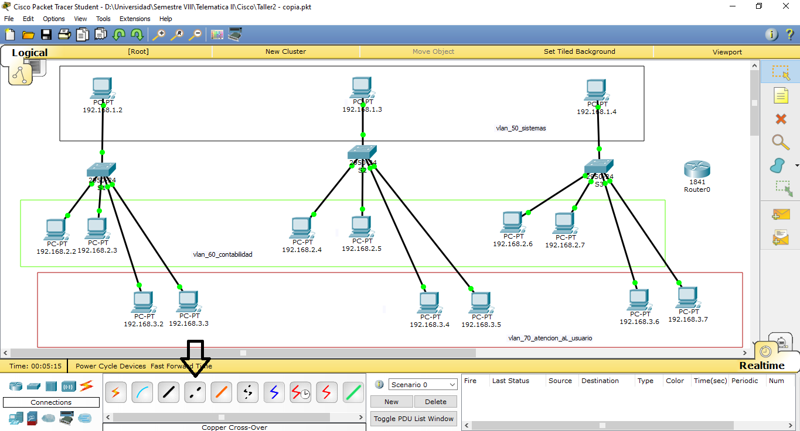
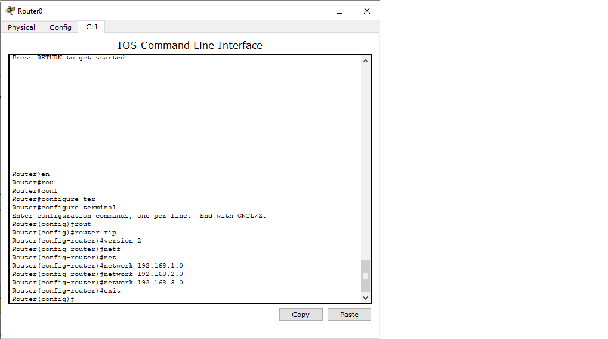

# Configuracion de vlans
Tutorial para la configuracion de vlans mediante el simulador cisco packet tracer student 

#### __INTRODUCCION:__ 
Como estudiante de Ingeniería en Sistemas de la Universidad de Nariño, considero que la configuración de VLANs en el simulador Cisco Packet Tracer es esencial para la segmentación del tráfico y el diseño eficiente de redes. Para ello, es necesario crear y asignar VLANs en los switches, configurar la comunicación entre ellas mediante el uso de enrutadores o capas de enrutamiento interno, y crear subinterfaces virtuales. Este proceso permite una mayor flexibilidad en el diseño de redes y una segmentación efectiva del tráfico, lo que resulta en una red más eficiente y fácil de administrar.

## __LABORATORIO CONFIGURACION VLANS__

### PASO 1: 

Abrir el simulador packet tracer y en la parte inferior izquierda podemos seleccionar los dispositivos que querramos utilizar, para este caso empezaremos a ubicar los computadores eligiendolos de la opcion __end devices__ donde escogemos el pc llamado __generic__ en la primera opcion. 

Seleccinamos la cantidad de PCs que vayamos a utilizar y los ubicaremos de la siguiente manera.

De preferencia nombrar cada PC con la ip que le vayamos asignar 

Para organizar nuestra area de trabajo y poder obervar mejor que PCs queremos en cada vlan se recomienda utilizar marcas para separar nuestras vlans como en la siguiente imagen.

Ya seleccionada la forma le podemos dar color a cada seccion y nombrar cada recuadro con el nombre de nuestra vlan, asi: 

## PASO 2: 

Una vez organizado nombrando cada equipo y cada area de trabajo es hora de configurar cada PC que hemos puesto, para esto daremos click en el icono del PC y se nos abrira la configuracion y daremos clic en __desktop__

Una vez dentro de la opcion __desktop__ pulsaremos el mouse en la opcion __IP configuration__ y le pondremos la IP que le asignamos de nombre en la parte inicial junto con el __Default gateway__

__Obervacion:__ el __Default gateway__ en este caso 192.168.1.1 solo se utilizara la primera vlan llamada __vlan 50 sistemas__ en las siguientes dos imagenes se mostrara el __Default gateway__ de las vlans __vlan 60 contabilidad__ y la __vlan 70 atencion al usuario__

PC tomado de la segunda seccion de nuestra vlan llamada __vlan 60 contabilidad__

PC tomado de la segunda seccion de nuestra vlan llamada __vlan 70 atencion al usuario__

## PASO 3:

Ya terminada la configuracion de cada equipo procedemos a ubicar los __switches__ que daran conexion a cada PC atraves de la creacion de las vlans.

En la parte inferior izquierda ubicaremos el mouse en la opcion de __switches__ donde seleccionaremos el switch numero __1841__ tal como se muestra en el imagen

## PASO 4:

Una vez concluida la ubicacion de los switches vamos a proceder a extender la conexion de cada PC mediante un cable llamado __Copper Straight-Through__ que se encuentra en la parte infierior izquierda en la opcion llamada __connection__ 

Ya seleccionado el cable procedemos a dar click en el primero switch llamado __S1__ y escogemos la interface 0/1 para el PC identficado con el nnumero de ip 192.168.1.2 de la primera vlan llamada __vlan 50 sistemas__ 

Daremos click en la interface de conexion 0/1 y procedemos a pulsar sobre el PC ya mencionado y escogemos la opcion que nos aparece ahi llamada __fastEthernet0__

Asi consecutivamente en todos los PC 

Para que los switches se conecten entre si utilizaremos el cabe llamado __Copper Cross-Over__ que se encuentra justo a la derecha del cable __Copper Straight-Through__

La primera conexion sera del switch __S1__ al switch __S2__ utilizando la interfaz de conexion 0/10 en ambos switches 

En este caso deje cuatro interfaces libres para futuras conexiones en la vlan

En el segundo switch llamado __S2__ daremos click sobre el y conectaremos el cable en la interfaz 0/15 para darle conexion con el switch __S3__

Conxion de switch S2 a switch S3

Nos quedaria de la siguiente manera

----------------------------------------------
__Nota:__

Repetiremos lo anteriormente explicado pero con las interfaces 0/16 del switch S1 a la misma interfaz del switch S2.

Del switch S2 utilizaremos la interfaz 0/17 al misma interfaz del switch S3

---------------------------------------------

Para lograr que los PCs del switch S1 y el switch 3 se vean entre si necesitaremos conectar un cable que una estos dos switches.

Aunque hayan cables conectados entre si todavia no exite conexion entre el switch S1 y el switch S3 que permita que los PCs de cada vlan se vean en la subred.

Para ello haremos lo siguiente:

Seleccionamos el cable de conexion __Copper Cross-Over__ y en el switch S1 utilizaremos la interfaz 0/11 que conectaremos de igual manera en el switch S3

De igual manera haremos lo mismo utilizando la interfaz 0/18 del switch S1 y del switch S3

## PASO 5:

Con todos los PCs ya conectados mediante los cables utilizando cada switch lo que vamos hacer es entrar a la configuracion de cada switch en la interfaz de comandos.

Primero ubicaremos el mouse en el icono de switch y daremos click, se nos abrirar la configuracion del switch y bucaremos la opcion __CLI__

Teniendo abierto esta ventana procedemos a crear las 3 vlan quie estamos utilizando 

Esto lo repetiremos en cada switch 

Ya creadas las vlans, lo siguiente sera configurar los puertos de cada vlan, esto se logra asignando el puerto a la vlan correspondiente

Esto lo haremos en el switch S1

El switch S1 quedaria configurado de la siguiente manera. 

Para ver las vlans y los puertos asignados utilizamos el comando enable y luego show vlan 

Foto tomada del switch S2 con sus respectivas vlans y sus puertos

Foto tomada del switch S3 con sus respectivas vlans y sus puertos

## PASO 6:

Los puertos del switch S1 y S3 0/11 y el 0/18 los pondremos en modo trunk con el siguiente comando 

Luego de haber puesto el modo trunk en los puertos anteriormente mencionados procedemos a quitar los cables con la opcion del simbolo X
en la parte derecha 

Lo siguiente sera poner en modo trunk los puertos 0/23 del switch S1 y S2, el puerto 0/24 del switch S2 y S3 y conectamos el cable __Copper Cross-Over__ en los puertos que activamos el modo trunk

Nos debe quedar de la siguiente manera el switch S1

Nos debe quedar de la siguiente manera el switch S2

Nos debe quedar de la siguiente manera el switch S3

## PASO 7:

Punto de Investigación para la Implementación
Las subredes 192.168.1.0, 192.168.2.0 y 192.168.3.0 se conectan entre sí, a través de un router en el cual se debe configurar un protocolo de enrutamiento en este caso el protocolo RIP (Protocolo de enrutamiento IP)

Para ello utilizaremos los comandos de la siguiente manera 

Conectaremos las vlans 50 y 60 en el puerto 0/0

Conectaremos la vlan 70 en el puerto 0/1

Nos debe quedar de esta manera 

## PASO 8:

Para activar el protocolo rip usaremos el siguiente comando 

En la siguiente imagen nos mostrara que funciona correctamente el protocolo RIP 

Finalmente haremos ping desde el PC 192.168.1.2 hasta el PC 192.168.3.7

